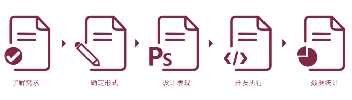

# DeliciousGo

### Steps for DeliciousGo 

> DeliciousGo 是一个大众用户，分享小吃图片，小吃地址，小吃体验的平台。
同时 给用户提供 寻找小吃 的美食攻略

## Why?

> 为什么要做这个项目？什么促使自己开启这个项目？

1. 有些吃货在本地，有寻找小吃的习惯，吃遍城市的愿望？但不一定，找得到的小吃

2. 有些吃货，想找到更多的好吃的小吃。通过别人的推荐和评论，获得信息

3. 吃货旅游时，怎么找到 当地最值得吃的小吃

## What?
> 项目能实现用户的什么需求？用户有什么需求？在各个阶段，如何预设项目的功能，来满足用户的需求

1. 

2. 

3.

## How?
> 用户的需求，如何表现？ 实际的功能是哪些，怎么实现？设计稿如何？

## Do？
> 平台将以什么形式实现？平台最终上线的方式，APP ？WEB ？

## Check
> 平台表现如何，用户的评价如何？通过使用数据和反馈数据，分析项目在每个阶段的问题，做出下一步的解决。